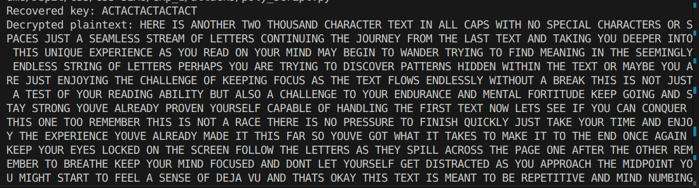

# CSS-SEM8
CSS code base 

Book - https://www.cs.vsb.cz/ochodkova/courses/kpb/cryptography-and-network-security_-principles-and-practice-7th-global-edition.pdf

Playfair CryptAnalysis -  https://www.nku.edu/~christensen/1901cscmat483%20Section%207%20Playfair%20cryptanalysis.pdf

# Output for attack on poly (Atharva's Plain Text)
- The plain_text was `plain_text_2.txt`
- Input is `cipher_text_poly_act.txt`
- Following is the output
